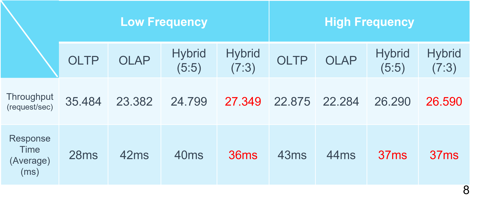
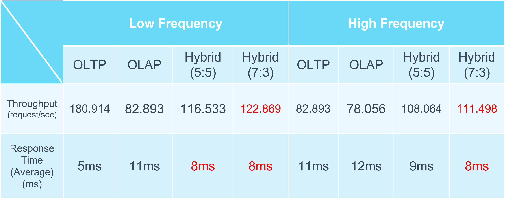

# Research-on-Performance-Optimization-of-OLTP-and-OLAP-Workloads-in-Hybrid-Database-Architecture
## 1. 安裝與啟動 SingleStore (Docker )

### 1.1 安裝 Docker

確認系統是否已安裝 Docker，可以執行以下指令來檢查：

```bash
docker --version
docker-compose --version
```

若尚未安裝，請前往 [Docker 官網](https://www.docker.com/) 下載安裝包，並依照官方說明完成安裝。

---

### 1.2 下載 SingleStore Docker 映像檔

使用 Docker Hub 下載 SingleStore 的單節點部署映像檔：

```bash
docker pull memsql/cluster-in-a-box
```

> 📦 `memsql/cluster-in-a-box` 是 SingleStore 提供的**單節點部署**解決方案，適合開發與測試用途。

---

### 1.3 啟動 SingleStore 容器

執行以下指令以啟動 SingleStore 並對外映射相關埠口：

```bash
docker run -d \
  --name singlestore \
  -p 3306:3306 \     # MySQL 預設端口
  -p 8080:8080 \     # SingleStore 管理介面端口
  -e LICENSE_KEY=<YOUR_LICENSE_KEY> \ # License 金鑰 (必須)
  memsql/cluster-in-a-box
```

---

### 📌 參數說明

- `--name singlestore`：指定容器名稱為 `singlestore`
- `-p 3306:3306`：開放 MySQL 預設連接埠
- `-p 8080:8080`：開放 SingleStore 管理介面連接埠
- `-e LICENSE_KEY=<YOUR_LICENSE_KEY>`：填入你的 License 金鑰
- `memsql/cluster-in-a-box`：使用剛剛下載的映像檔來啟動容器

---

## 2. 專案結構

建議的專案目錄結構如下：
```bash
project/
│
├── JMeter_setting
├── docs                 # 實驗結果及圖片
├── requirements.txt     # python套件         
├── src                  
  ├── initialize         # 初始化和刪除在singlestore的資料集
  ├── operator           # OLTP, OLAP, HYBRID 的 operation
  └── turn_into_graph    # 把測試的結果轉為圖片
└── README.md                  

```
## 3. 專案特色

- ✅ **模擬真實交易情境：** 以 Faker 自動產生 10 萬筆交易資料，還原銀行系統日常操作
- 🔄 **支援 OLTP / OLAP / Hybrid 操作：** 可依比例模擬實務環境下的混合查詢負載
- 📊 **效能觀測與分析：** 透過 JMeter + Python 分析 CPU 使用率與查詢回應
- 🐳 **Docker 部署快速：** 採用 SingleStore Docker 映像，即時部署測試環境

---

### 3.1 實驗結果摘要

- **OLTP 效能佳**：在單核心與四核心下皆展現穩定表現，但高頻繁操作下易出現延遲
- **OLAP 資源密集**：屬計算密集型，需仰賴多核心提升效能，在查詢複雜度高時耗費更多時間
- **Hybrid 模式效果最佳**：在 50:50 或 70:30（偏向 OLTP）混合情況下，整體吞吐與 CPU 使用效率最佳
- **高頻情境下趨近飽和**：Hybrid 模式能達成調度與計算間平衡，維持效能穩定性

---

## 4. 單核心與四核心比較分析

>   

### 4.1 Throughput 與 Response Time（低頻 vs 高頻）：

- **單核心低頻情況下：**
  - OLTP 吞吐量最高，Hybrid 模式介於中間；OLAP 表現較差。
  - Response time 方面，OLTP 最快（28ms），OLAP 最慢（42ms），Hybrid 穩定（36~40ms）。

- **單核心高頻下：**
  - 所有模式 CPU 幾近飽和，OLTP throughput 下滑明顯，Hybrid 仍略有優勢（26.59 req/sec）。
  - Hybrid 模式在 response time（37ms）上與 OLTP/OLAP 相當，但穩定性較好。

- **多核心低頻情況：**
  - 所有模式 throughput 倍數提升，OLTP 明顯最高（180 req/sec 以上）。
  - Hybrid 7:3 模式兼具 throughput（122.869）與回應速度（8ms）。

- **多核心高頻下：**
  - 所有模式 CPU 幾近滿載（8 核心 ≒ 800%）。Hybrid 模式在 throughput 與 response time 仍保持平衡。

---

### 4.2 CPU 使用率分析：

>（⬇ 此處可插入圖片）

- **單核心 + 低頻：**
  - OLAP 使用率最高（53.53%），OLTP 約 33.64%，Hybrid 明顯較低（17~19%）。
  - 顯示 Hybrid 可有效降低單核心下的排程壓力與 context switching。

- **單核心 + 高頻：**
  - 所有模式 CPU 幾乎達到 100%，處於系統瓶頸狀態。
  - Hybrid 模式能與 OLTP/OLAP 均衡分配資源（平均使用率均在 100% 附近）。

- **多核心 + 低頻：**
  - OLAP 明顯吃掉大部分資源（84.29%），Hybrid 模式平均分配負載（31~34%）。
  - OLTP 使用率最輕，顯示其主要由大量 I/O 與頻繁切換造成效能瓶頸。

- **多核心 + 高頻：**
  - 所有模式 CPU 使用率都很高，OLAP 達到近 280%，Hybrid 模式（50:50）分配均勻最穩定。

> **結論：Hybrid 模式在多核環境中有明顯平衡效能與資源利用的優勢，特別是在高頻高負載情況下能維持穩定的 throughput 與 response time。**

>（⬇ 此處可插入圖片）

### 4.3 CPU 整體觀察與結論：

- OLAP 模式在所有情境下 CPU 使用率最高，尤其在多核心 + 高頻下達到 **279.81%**，顯示其為計算密集型查詢負載。

- OLTP 模式 CPU 使用較少（單核約 33%、多核約 140%），但在高頻下無法有效利用所有核心，推測瓶頸來自資料庫 I/O 或頻繁的 thread switching。

- Hybrid 模式在所有情境中皆展現良好彈性：

  - 在低頻下 CPU 使用率最低（如單核 17 ~ 19%、多核 31 ~ 34%），顯示出良好的資源節省能力。
  - 在高頻下，Hybrid 模式能穩定使用多核心資源（如多核 Hybrid 7:3 平均 218.75%，50:50 為 237.87%），
    顯示其在高併發情境下可以平衡 OLTP/OLAP 任務負載，避免極端資源傾斜。

>  **結論：** Hybrid 模式在 CPU 使用效率與分配平衡上具備明顯優勢，特別是在多核 + 高頻情境下，
能同時達到高資源使用率與穩定輸出效能。

---
